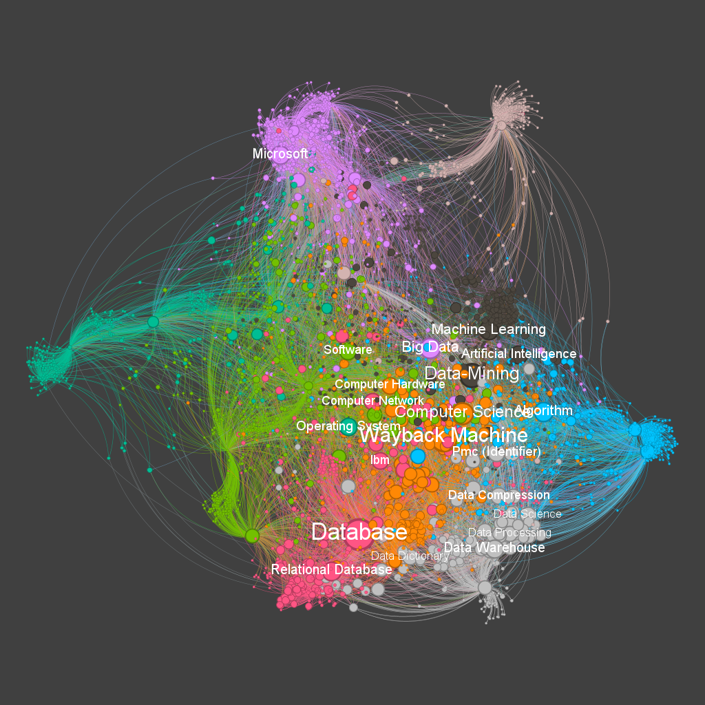

# Network Visualization with Gephi and GitHub Pages

This repository contains a project that focuses on exporting network visualizations created with Gephi and hosting them on GitHub Pages. The project aims to generate interactive web pages that display the network and allow users to explore and interact with the nodes and edges.

## Project Overview

The Network Visualization with Gephi and GitHub Pages project provides a workflow for creating visually appealing network visualizations and sharing them online. The project utilizes Gephi, a powerful network analysis and visualization software, to create the network graphs. The generated graphs are then exported as interactive web pages using Gephi's built-in export features.

GitHub Pages is used to host the exported web pages, making it easy to share and access the visualizations through a web browser. Users can explore the network, zoom in/out, and interact with individual nodes and edges to gain insights and discover patterns within the network.

## Component
- João Marcos Viana Silva

## Workflow

The project workflow consists of the following steps:

1. **Data Preparation**: Prepare the network data in a compatible format (.graphml) that can be imported into Gephi. Ensure that the data includes information about the nodes and edges, such as labels, attributes, and weights.

2. **Network Visualization**: Import the prepared data into Gephi and utilize its features to create an aesthetically pleasing network visualization. Customize the layout, node size, color, and edge properties to effectively represent the network's structure and relationships.

3. **Export as Web Pages**: Once the network visualization is complete, export it as an interactive web page using Gephi's export functionality. Choose the appropriate format (HTML) and ensure that the exported files include the necessary dependencies (e.g., JavaScript, CSS) for interactivity.

4. **GitHub Pages Hosting**: Create a GitHub repository and enable GitHub Pages to host the exported web pages. Upload the exported files to the repository, ensuring that the necessary file structure and dependencies are preserved. Verify that the web pages render correctly and are interactive.

5. **Access and Share**: Share the network visualization by providing the GitHub Pages URL to others. Users can access the web page through their web browsers and explore the network visualization interactively. The visualizations can be embedded in other websites or shared via direct links.

## Example

To see an example of the network visualization generated with Gephi and hosted on GitHub Pages, please visit the [Example Network Visualization](https://jota-emi.github.io/wiki_network_data_eng/network/).

## Customization

Feel free to customize the network visualization based on your specific needs. Modify the Gephi settings, such as node color, size, and layout algorithms, to enhance the visual representation of the network. Additionally, you can adapt the web page design and interactivity by modifying the HTML, CSS, and JavaScript files.

## Explanation Video

For a detailed walkthrough of the Network Visualization with Gephi and GitHub Pages project, you can watch the explanation video [here](https://www.example.com).

